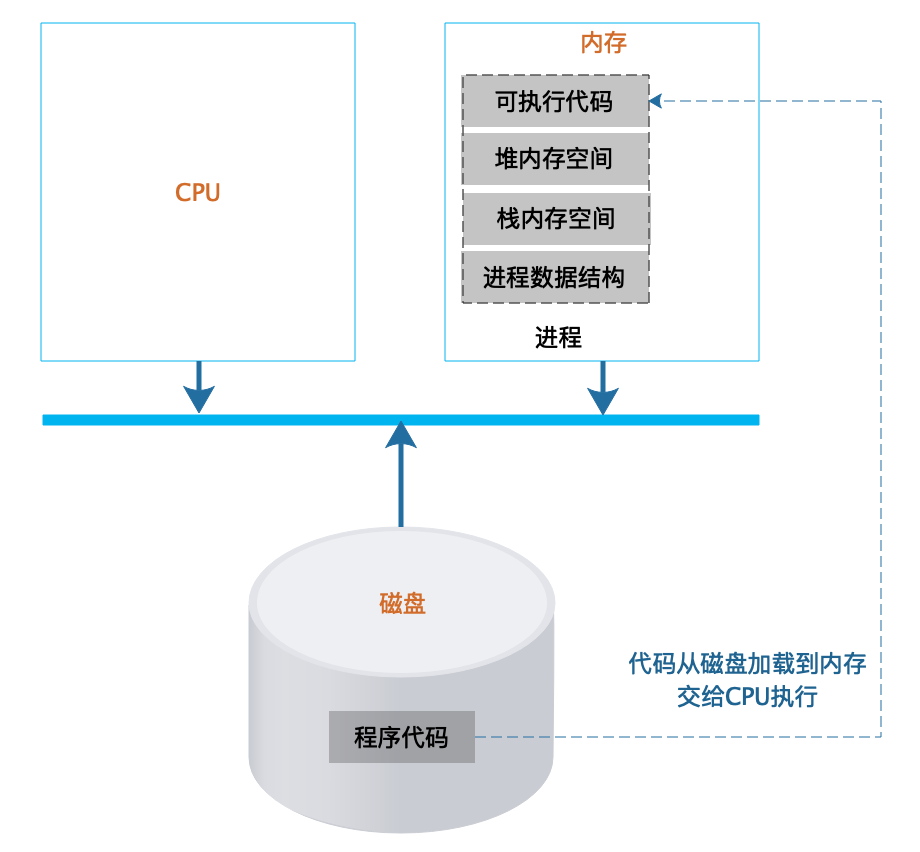

# 1 程序是如何运行的，又是如何崩溃的？
## 程序 VS 进程

**程序是静态的**，要想让程序处理数据，必须先把程序从外部设备加载到内存中，并在操作系统的调度下交给 CPU 执行。

程序运行起来之后被称为进程，**进程是动态的**。进程除了包含可执行的程序代码，还包括进程在运行期使用的内存堆空间、栈空间以及供系统管理使用的数据结构。

操作系统把可执行代码加载到内存中，生成相应的数据结构和内存空间后，就从可执行代码的起始位置读取指令交给 CPU 执行。

程序运行时如果需要创建数组等数据结构，操作系统就会在**进程的堆空间**申请一块相应的内存空间，并把这块内存的首地址信息记录在进程的栈中。堆是一块无序的内存空间，任何时候需要使用内存，都会从堆空间中分配，分配到的内存地址则记录在栈中。

栈是一个严格的后进先出数据结构，同样由操作系统维护，主要用来记录函数内部的局部变量、堆空间分配的内存空间地址等。**每次函数调用时，操作系统都会在栈中创建一个栈帧（stack frame），函数的参数、局部变量、申请的内存地址等都在当前栈帧中**。另外，因为**栈帧之间是相互隔离的**，所以不同函数可以定义相同的变量而不会发生混乱。

## 多进程 VS 多线程

依靠操作系统的 **CPU 分时共享技术**，进程可以并发地在一个 CPU 核心上执行。虽然从外部看起来像是多个进程在同时运行，但实际上，**进程并不总是在 CPU 上运行**。一方面进程共享 CPU，所以需要等待 CPU；另一方面，进程在执行 I/O 操作的时候，也不需要 CPU 运行。

**进程的生命周期中，主要有三种状态：运行、就绪、阻塞**。

* 运行：当一个进程正在 CPU 上运行，则该进程处于运行状态。处于运行状态的进程数目小于等于 CPU 的数目。
* 就绪：也称为等待运行状态，当进程获得了除 CPU 以外的其他一切资源，只要再获得 CPU 就可以运行，则该进程处于就绪状态。
* 阻塞：也称为等待或睡眠状态，当一个进程正在等待某一事件发生而暂时停止运行，这时即使把 CPU 分配给该进程也无法运行，则该进程处于阻塞状态。(某一事件，例如等待 I/O 完成、等待锁)

线程，可以理解为轻量级的进程，线程是在进程内创建的，从逻辑上看，进程的主要概念都可以套用在线程上。

## 应用运行变慢以及崩溃的原因

> 现代软件系统主要使用多线程技术实现多任务处理。

### Web 应用应对并发请求的基本原理

Tomcat 负责启动多线程，即为每一个用户请求分配一个处理线程，来调用和请求 URL 路径相对应的 Servlet 或 Controller 代码，以完成用户请求。也就是说，基于这种实现形式的 Web 应用天然支持多任务处理。

### 线程安全与锁

> CPU 以线程为最基本单位进行分时共享执行。

如果有多个线程同时执行同一段代码，并且这段代码会去修改堆空间的全局数据时，那么就出现了**线程安全问题**。

**多个线程访问共享资源的这段代码被称为临界区，解决线程安全问题的主要方法是使用锁。也就是将临界区的代码加锁，只有获得锁的线程才能执行临界区代码。**

**锁机制能够解决线程安全问题，可是也会带来新的问题：锁会引起线程阻塞，并可能会进一步导致高并发问题**。线程为了执行临界区代码就必须排队获得锁，也就是说，如果没有获得锁，线程就会进入阻塞状态，等待其他释放锁的线程将自己唤醒重新获得锁。

在高并发的情况下，排队的线程数量越来越多，线程无法并发执行，这带给我们最直观的感受就是系统响应变慢。从这里也可以知道，如果系统的响应变慢，那么通常是线程无法并发执行造成的，进一步地说，可能是出现了线程安全问题。

被阻塞的线程越多，占据的系统资源也越多，这些被阻塞的线程既不能继续执行，也不能释放当前已经占据的资源。如果被阻塞的线程数超过了系统资源的极限，就会导致应用崩溃。

### 如何解决高并发问题

解决应用因高并发而导致的响应变慢、应用崩溃的主要手段是使用分布式系统架构、请求限流、业务降级以减少线程的资源消耗。

## 问题

1. 为什么切换进程的代价大于切换线程的代价？
2. Tomat 是否也只不过是 JVM 进程创建的一个线程而已？进一步地，所有处理用户请求的线程也只不过 Tomcat 线程的子线程而已？
3. 引起线程阻塞的原因有哪些？
  1. 锁
  2. I/O
  3. 数据库连接，因为数据库的连接也是有限的。
4. 如何保证锁本身是线程安全的？或者说，在操作系统以及 CPU 层面是如何实现锁机制的？（即不能出现多个线程同时获得锁的情况）

## 老师回复
### Tomat 是否也只不过是 JVM 进程创建的一个线程而已？进一步地，所有处理用户请求的线程也只不过 Tomcat 线程的子线程而已？

JVM是一个进程；tomcat是一个框架；tomcat会启动线程处理应用请求，执行应用的代码；应用自己不能跑起来的，只能被tomcat的线程执行，应用在tomcat线程中执行时，也可以自己启动线程，并发、异步执行自己的某些计算。

tomcat会对不同应用做一些隔离，但是如果某个应用导致JVM crash，所有应用都crash。

可参考后续专栏《JVM虚拟机原理》

### 关于运行时的回复

C/C++ 的执行代码直接交给操作系统调度管理，Java 和 Go 的执行代码在 JVM 和 Go 的虚拟机环境中运行，不仅仅是垃圾回收，Java 和 Go 的虚拟机职责也不一样。

详情可参考后续专栏《JVM虚拟机原理》。
