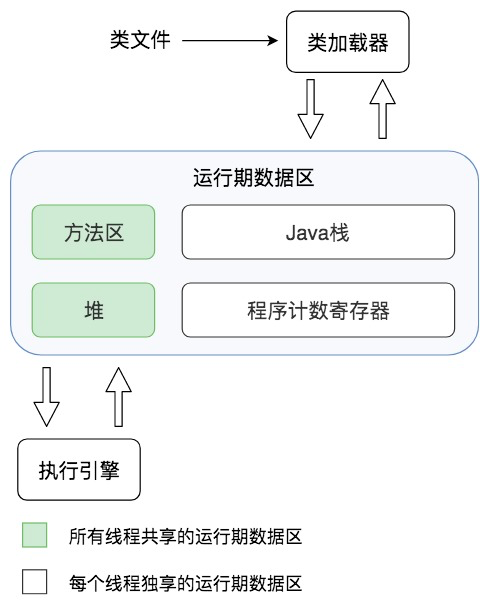

# 为什么 JVM 被称为机器
## 操作系统是如何运行在不同 ISA 的 CPU 上的

> 以下是知乎上回答的收集。

### [不同的 CPU 会提供不同的指令集](https://www.zhihu.com/question/68068271/answer/261835892)

**不同的 CPU 会提供不同的指令集(即处理器体系结构 ISA 不同)，而操作系统要适配这些指令集，所以不同的指令集的系统的是不通用的。**

比如 x86 的 Windows 系统只能运行在使用 x86 指令集的 CPU (主要是 Intel，AMD)，而不能运行在使用 arm 指令的 CPU 上(有专门的windows RT系统)。苹果电脑早期是使用 IBM 的 POWER 架构的 CPU，所以 macOS 不能运行在普通电脑上，后来改成使用 Intel CPU 就可以运行在普通 PC 上了(黑苹果)。

思考：CPU 指令集对 OS 不透明的角度。

### [现代操作系统对 CPU 进行了抽象](https://www.zhihu.com/question/68068271/answer/260873955)

大部分的 CPU 都有寄存器组，MMU 和 cache，中断控制器，特权级别，trap 指令，原子指令，高精度定时器，内存控制器等。**操作系统对这些东西进行了抽象，制定出一组标准的 API 接口，只要特定的 CPU 架构准确的实现了这些 API，移植一个操作系统到一个 CPU 并不是很难。**

比如 MMU 用来虚拟内存和独立进程空间；中断控制器用来管理一切异常，比如外设中断，CPU 自身的保护等；特权级别用来保护 OS 内核；trap 指令用来实现系统调用；原子指令来实现各种原子操作和锁，比如 spinlock，rwlock，信号量，互斥量；高精度定时器用来实现内核调度；内存控制器，用来扩展 CPU 可以自由使用的空间。另外操作系统的理论已经很完善，毕竟操作发展了大约 70 年，就连虚拟化这些技术也发展了大约 60 年。

思考：CPU 指令集对 OS 透明的角度。

### 关于 CPU 指令集对 OS 透明度的猜想 

CPU 指令集是没法做到对 OS 完全透明的，比如对性能要求苛刻的功能往往需要使用汇编来实现。但是 OS 对 CPU 的抽象会导致，CPU 指令集在一定程度上提供了透明度，这也就为 OS 在兼容不同硬件平台方面提供了很大的便利。

## 为什么 JVM 会被称为机器
### Java 跨平台的含义

* Java 跨平台是指跨操作系统平台，而不是硬件级别的平台，如 x86 或 arm。
* Java 程序是跨平台的，但 JVM/JDK 并不是跨平台的，**JVM 屏蔽了底层操作系统的差异，为 Java 字节码文件构造了一个统一的运行环境。**
* JVM 本质上也是一个应用程序，启动之后加载并执行 Java 字节码文件。

> JVM 屏蔽了底层操作系统的差异，为 Java 字节码文件构造了一个统一的运行环境。

这表明 JVM 为 Java 字节码文件的执行模拟出了一个标准机器，这个机器的相关概念是对操作系统对应概念的抽象。比如，类加载器是对硬盘的抽象、运行时数据区是对内存的抽象、执行引擎是对 CPU 的抽象。

更进一步地讲，JVM 封装了一组自定义的字节码指令集，有自己的程序计数器和执行引擎，像 CPU 一样，可以执行运算指令;它还像操作系统一样有自己的程序装载与运行机制，内存管理机制，线程及栈管理机制。从这些角度看来，JVM 就是一台完整的计算机，这就是 JVM 被称为机器的原因。

## 从 Java 线程栈的角度思考线程安全问题
### 基本类型

由于线程栈之间的隔离性，所以基本类型变量一定是线程安全的。

### 引用类型

对于引用类型变量来说，其对象是存放在堆里，但其引用变量是存放在栈里的。如果该引用变量没有被方法返回或放入某些外部对象容器中，那么其对象也是线程安全的。

需要注意的是，**线程不安全，不一定会引发线程安全问题**。例如，对于**无状态对象**而言，多线程执行无状态对象的方法是不会引发线程安全问题的。

所谓的**无状态对象**，即不会记录状态的对象，也就是说，是只有方法没有属性的对象。例如，Servlet 是线程不安全的，但由于通常将 Servlet 设计为**无状态对象**，所以多线程执行 Servlet 方法时，不会引发线程安全问题。

当 JVM 进入启动类的 `main` 方法时，就会为应用程序创建一个主线程，`main` 方法里的代码就会被这个主线程执行。

## JIT

**JVM 的执行引擎在执行字节码指令，是解释执行的；也就是说，每条字节码指令都会被解释成底层的 CPU 指令**。但是这种解释执行的效率比较差，JVM 对此进行了优化，将频繁执行的代码编译为 CPU 指令直接存储起来，之后再次执行的时候，直接执行编译好的 CPU 指令，而不是再次解释执行字节码指令。这就是 JVM 的即时编译 JIT。

## JVM GC

GC 即将 JVM 堆中已经不再被使用的对象清理掉，以释放宝贵的内存资源。GC 有两个主要的步骤：标记对象、回收对象。这两个步骤可以选择相应的方法来完成。

### 标记对象

* 可达性分析算法，一种引用标记算法

### 回收对象

* 清理
* 压缩
* 复制

### 分代回收

JVM 在进行具体的垃圾回收时，采用分代回收的机制。在分代回收急之下，JVM 将堆划分为以下区域：

* 新生代区
  * Eden 区
  * From 区
  * To 区
* 老年代区

另外，JVM 的垃圾回收器主要有以下几种：

* Serial
* Parallel
* CMS
* G1

分代回收的步骤：

* Minor GC：对新生代区进行 GC
* Full GC：对新生代区和老年代区进行 GC

### See also

* [一文吃透 JVM 分代回收机制](https://juejin.im/post/5c89058be51d4519c33fbef3)

## 实战思考
### OutOfMemoryError

OutOfMemoryError 表示堆空间不足，可能存在以下两种情况：

* 可能存在内存泄漏：使用 jmap 命令查看堆中的对象情况
* 堆空间不足：调整 -Xmx 参数增加内存空间

### StackOverflowError

StackOverflowError 表示线程栈空间不足，可能存在以下两种情况：

* 存在错误的递归调用，导致栈帧太多：通过栈异常信息进行分析
* 线程栈空间不足：调整 -Xss 参数增加栈空间大小

### 程序运行卡顿、响应延迟严重

* 可能存在线程并发问题，导致大量线程处于阻塞状态
* 垃圾回收器对程序的影响：通过 jstat 命令查看垃圾回收期的运行状况，是否存在较长时间的 Full GC，然后调整垃圾回收器的相关参数，使垃圾回收对程序运行的影响尽可能小
