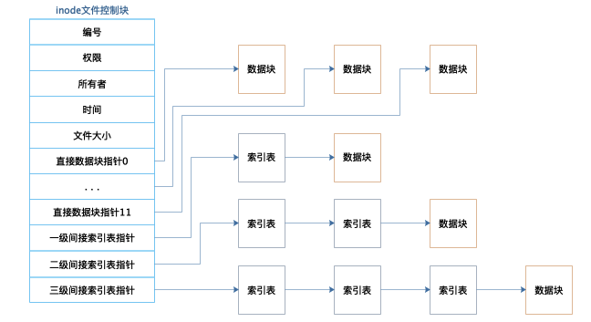

# 5 文件系统原理

## See also

* [操作系统对硬盘的抽象](https://www.cnblogs.com/ysocean/p/7501903.html)
* [文件系统原理](https://www.ruanyifeng.com/blog/2011/12/inode.html)
* [文件系统原理](https://zhuanlan.zhihu.com/p/40604943)
* [硬盘格式化](https://zh.wikipedia.org/wiki/%E7%A3%81%E7%9B%98%E6%A0%BC%E5%BC%8F%E5%8C%96)
* [快速格式化与一般格式化](http://m.lotpc.com/dnzs/7092.html)
* [Hadoop HDFS](https://hadoop.apache.org/docs/r1.0.4/cn/index.html)

## 机械硬盘 VS 固态硬盘
### 机械硬盘

* 具有磁性特质的存储介质，因此硬盘也被称为磁盘
* 具有电机驱动的机械式结构：盘片、主轴、磁头臂、磁头

机械硬盘的读取需要执行机械动作，这是机械硬盘访问延迟的主要原因。如果文件在机械硬盘上不是连续存储的，那么对文件的访问需要多次机械动作，访问的速度就会更慢。

### 固态硬盘

* 没有机械结构，访问也不需要执行机械动作
* 通过主控芯片控制闪存颗粒进行数据读取，即电子操作而非机械动作

### 场景决策

如果一个用户场景对数据访问速度、存储容量、成本都有较高的要求，那么可以采用机械硬盘和固态硬盘混合部署的方式。

问题：程序如何控制使用哪种硬盘？

## 文件系统原理

> 文件是操作系统对 I/O 设备抽象的产物。

从硬盘的视角看，硬盘的最小存储单位是扇区 sector，每个扇区存储 512 个字节，即 0.5 KB。

但从操作系统的角度看，一次读取一个扇区的效率太低；因此操作系统一次性连续读取多个扇区，这多个扇区称为块 block。块的大小，最常见的是 4 KB，即连续 8 个扇区组成一个块。

文件系统将硬盘空间以块为单位进行划分，每个文件占据若干个块，然后再通过一个文件控制块 FCB 记录每个文件占据的硬盘数据块。

在 Linux 系统中，FCB 就是 inode。inode 记录文件权限、所有者、修改时间和文件大小等文件属性信息，以及文件数据块硬盘索引地址。想要访问文件，就必须获得文件的 inode。

inode 的结构是固定的，能够记录的硬盘地址索引数也是固定的。**由于 inode 的限制，因此，单个文件的大小也是有限制的。**

## RAID 独立硬盘冗余阵列

RAID 通过硬件 RAID 卡或者软件 RAID 方案，将单台服务器的多块硬盘管理起来，使其共同对外提供服务。

RAID 的核心思路是利用文件系统将数据写入硬盘中不同数据块的特性，将多块硬盘看做一个整体进行读写，也就是说，一个文件的多个数据块可能写入多个硬盘。

根据硬盘的组织和使用方式的不同，RAID 可分为 RAID 0、RAID 1、RAID 10、RAID 5、RAID 6。不同的方案的存储容量、读取速度、文件可用性都有所不同。

## 分布式文件系统

在 Linux 的文件系统中，inode 记录了文件的元数据信息，包括了数据块在硬盘上的地址。如果在 inode 记录的是数据块在其他服务器硬盘上的地址信息，这就变成了**分布式文件系统**。从存储容量、访问速度、文件可用性上看，分布式文件系统的思路都是和 RAID 一脉相承的；两者都是将数据分为许多片，然后向多个硬盘上（或多台服务器的硬盘）同时读写。

**HDFS 的关键组件有两个，一个是 DataNode，一个是 NameNode。**

DataNode 负责文件数据的存储和读写，HDFS 将文件数据分为若干个数据块，每个 DataNode 存储一部分数据块，这样文件就分布存储在整个 HDFS 服务器集群中。

NameNode 负责整个 HDFS 集群的元数据管理，相当于 Linux 文件系统中的 inode 角色。

在实践中，DataNode 服务器有很多台，一般在几百台到几千台的规模，每台服务器配置数块硬盘，这样规模的集群极大地提高了存储容量、访问速度、文件可用性。

有了 HDFS，可以实现单个文件存储几百 T 单位的数据，再配合大数据计算框架 MapReduce 或 Spark，可以对这个文件的数据块进行并发计算。

## 小结

文件系统从简单操作系统文件，到 RAID，再到分布式文件系统，其设计思路其实是具有统一性的。

* 满足单个文件存储越来越大的需求
* 满足读写速度越来越快的需求
* 满足文件高可用的需求

